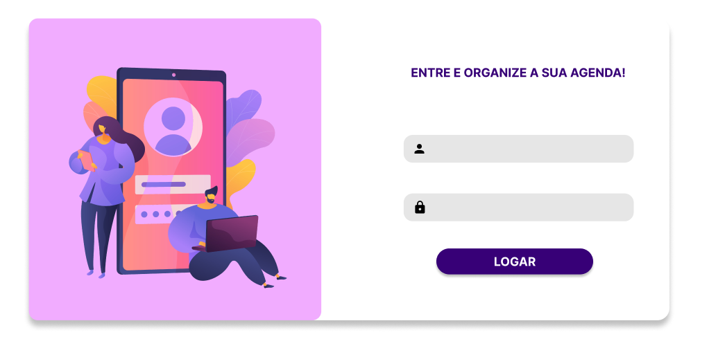

## ORGANIZADOR DE BUFFET

* Logar com o usuário;
* Criar, atualizar, excluir e listar toda a sua agenda;

Tecnologias utilizadas:
* Java 24
* Springboot para API.
* HTML e CSS para interface.
* JavaScript para consumo de API.
* Banco de dados: MySQL.

---

**TELA DE LOGIN FRONT:**
